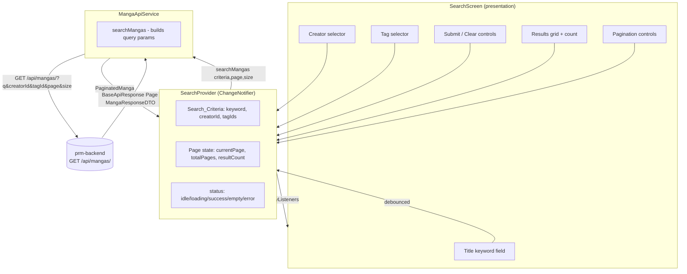
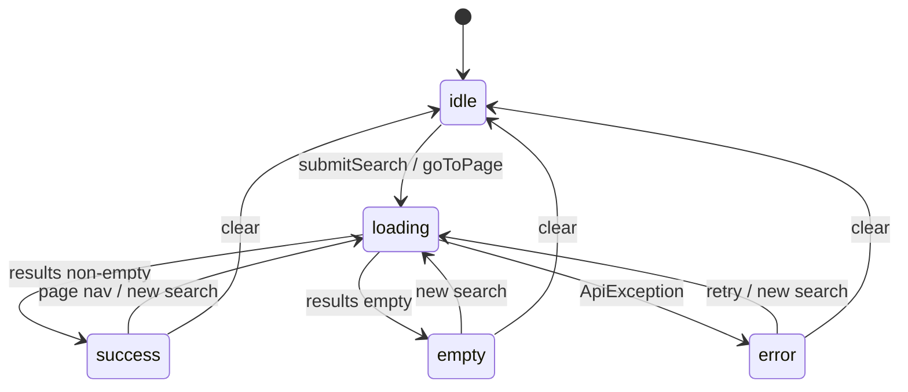

# Design Document

## Overview

The Manga Search feature lets a reader find manga by **title keyword**, **creator** (author/artist), and **tag**, with all three criteria combinable in a single query. It produces a paginated result set, a total match count, and page-navigation controls.

The work spans two repositories:

- **Backend** (`prm-backend`, a separate Spring Boot repo, not in this workspace): the existing manga list/filter endpoint `GET /api/mangas/` is extended to also accept a **creator** filter and a **keyword** filter, combined with the existing tag filter, returning a Spring `Page<MangaResponseDTO>` inside the standard `BaseApiResponse` envelope.
- **Frontend** (`norumanga-client/`, this workspace): a Flutter app using Provider + a Dio-based HTTP client. We add a search request operation to `MangaApiService`, a dedicated `SearchProvider` (`ChangeNotifier`), a `SearchScreen` with input controls, a results view, and pagination controls, then wire the existing `/search` route to the real screen instead of the placeholder.

All user-facing text is Vietnamese, reusing and extending `lib/core/constants/app_strings_vi.dart`, and the UI follows the existing "Manga Brutalism" dark theme (hard borders, offset box shadows, `Anton`/`Syne` fonts, `AppColors` palette).

### Research Notes & Key Findings

Findings from inspecting the existing codebase that directly shape this design:

- **Response envelope differs from the public API doc.** The Flutter `BaseApiResponse` (`lib/data/network/base_api_response.dart`) parses `{ timestamp, message, data, errors }`, where `errors` is a `Map<String, dynamic>?`. The error path is keyed `errors`, not `error`. The design follows the *actual* client model, not the `api_document.md` sketch.
- **Manga JSON is camelCase.** `Manga.fromJson` (`lib/data/models/manga.dart`) reads `id`, `title`, `slug`, `description`, `coverUrl`, `creators` (list of objects → mapped to names), `tags` (list of objects → mapped to names), `isPremium`, `updatedAt`. There is no snake_case here, unlike the older doc templates.
- **Paginated parsing already exists.** `MangaApiService.getMangas` (`lib/data/network/manga_api_service.dart`) already parses the Spring `Page` shape (`content`, `totalPages`, `totalElements`, `number`) into a `PaginatedManga` value object. The search operation reuses this exact pattern and value object.
- **Endpoint base-path rewrite pattern.** Service methods derive non-`/api/v1` paths via `_apiService.dio.options.baseUrl.replaceAll('/api/v1', '/api/mangas')`. The search call uses the same rewrite to hit `/api/mangas/`.
- **Provider pattern.** Providers (`MangaProvider`, `CreatorProvider`, `TagProvider`) are `ChangeNotifier`s constructed with their API service, expose `isLoading` / `errorMessage`, catch `ApiException` to surface `e.message`, and `notifyListeners()` in a `finally`. `MangaProvider` already exposes pagination 1-indexed to the UI while storing the 0-indexed backend page. `SearchProvider` mirrors these conventions.
- **Existing string constants.** `AppStringsVi` already declares a SEARCH SCREEN group (`searchTitle = 'TÌM KIẾM'`, `noResults = 'Không tìm thấy kết quả'`, etc.) plus common actions (`previous`, `next`, `reset`, `tryAgain`, `loading`). We extend this group with the result-count phrase and selector labels rather than introducing a new file.
- **Route placeholder.** `AppRouter.search` (`/search`) currently builds `PlaceholderScreen(screenName: 'Search')`. The home search bar already navigates to `AppRouter.search`. Only the route target changes.
- **Creators & tags are already fetchable.** `CreatorApiService.getAllCreators()` (`GET /api/creators`) and `TagApiService.getAllTags()` (`GET /api/tags`) exist and return `List<Creator>` / `List<Tag>` with `id`, `name`, `slug`. The selectors reuse `CreatorProvider` and `TagProvider`.

## Architecture

### High-level flow



### Layered responsibilities

| Layer | Component | Responsibility |
|-------|-----------|----------------|
| Backend | `MangaController` + service/repository | Compose keyword + creator + tag filters into one query; return paginated `Page<MangaResponseDTO>` in the envelope; validate pagination params |
| Client network | `MangaApiService.searchMangas` | Build query parameters from criteria, call `/api/mangas/`, parse the `Page` into `PaginatedManga`, raise `ApiException` on failure |
| Client state | `SearchProvider` | Hold `Search_Criteria`, results, `Result_Count`, pagination, status; orchestrate requests and page navigation |
| Client selectors | `CreatorProvider`, `TagProvider` | Provide creator/tag lists for the selectors (already implemented) |
| Client UI | `SearchScreen` + widgets | Render inputs, debounce keyword, show loading/empty/error/results states, count, and pagination controls in Vietnamese |
| Routing | `AppRouter` | Map `/search` to `SearchScreen` |

### Backend endpoint extension

The `Manga_Query_Endpoint` is the existing filter endpoint `GET /api/mangas/`. It currently accepts `genreId`, `tagId`, `status`, `licenseStatus`, `page`, `size`. The extension adds:

- `q` (string, optional): the `Title_Keyword`, matched against title, slug, and description (same matching the existing `/search` already performs).
- `creatorId` (string, optional): the `Creator_Filter`, matching manga whose author **or** artist list contains this creator id.
- `tagId` (string, repeatable, optional): the `Tag_Filter`. When multiple `tagId` values are supplied, results must match **every** supplied tag (AND semantics, per Requirement 1.3).

All supplied criteria are combined with AND. When no criteria are supplied, the unfiltered, paginated manga list is returned. Pagination keeps Spring defaults (`page=0`, `size=20`) and validates that `page >= 0` and `size >= 1`, returning an error envelope otherwise.

> Note: the backend lives in a separate repository. This document specifies the contract and the filter/pagination semantics the client depends on; backend implementation tasks reference these criteria.

## Components and Interfaces

### 1. `MangaApiService.searchMangas` (client network)

Add a search operation alongside the existing methods. It reuses the existing `PaginatedManga` value object and the `BaseApiResponse` parsing already used by `getMangas`.

```dart
// lib/data/network/manga_api_service.dart
Future<PaginatedManga> searchMangas({
  String? keyword,          // Title_Keyword
  String? creatorId,        // Creator_Filter
  List<String>? tagIds,     // Tag_Filter (AND across ids)
  int page = 0,             // Page_Index (0-based, Spring)
  int size = 20,            // Page_Size
}) async {
  final Map<String, dynamic> queryParams = {
    'page': page,
    'size': size,
  };
  if (keyword != null && keyword.trim().isNotEmpty) {
    queryParams['q'] = keyword.trim();
  }
  if (creatorId != null && creatorId.isNotEmpty) {
    queryParams['creatorId'] = creatorId;
  }
  if (tagIds != null && tagIds.isNotEmpty) {
    queryParams['tagId'] = tagIds; // Dio serializes a list as repeated params
  }

  final response = await _apiService.dio.get(
    _apiService.dio.options.baseUrl.replaceAll('/api/v1', '/api/mangas'),
    queryParameters: queryParams,
  );

  final baseResponse = BaseApiResponse<Map<String, dynamic>>.fromJson(
    response.data,
    (json) => json as Map<String, dynamic>,
  );

  final dataMap = baseResponse.data;
  if (dataMap == null) {
    return PaginatedManga(mangas: [], totalPages: 0, totalElements: 0, currentPage: 0);
  }

  final contentList = dataMap['content'] as List<dynamic>? ?? [];
  final mangas = contentList
      .map((item) => Manga.fromJson(item as Map<String, dynamic>))
      .toList();

  return PaginatedManga(
    mangas: mangas,
    totalPages: dataMap['totalPages'] as int? ?? 0,
    totalElements: dataMap['totalElements'] as int? ?? 0,
    currentPage: dataMap['number'] as int? ?? 0,
  );
}
```

- Errors from Dio are already normalized to `ApiException` by the `onError` interceptor in `ApiService`; `SearchProvider` catches `ApiException` and surfaces `message` (Requirement 4.6).
- Query-parameter construction is isolated into a small pure helper so it can be unit/property tested without a live Dio call:

```dart
@visibleForTesting
Map<String, dynamic> buildSearchQuery({
  String? keyword,
  String? creatorId,
  List<String>? tagIds,
  int page = 0,
  int size = 20,
});
```

### 2. `SearchProvider` (client state)

A new `ChangeNotifier` at `lib/providers/search_provider.dart`, constructed with `MangaApiService` (mirroring `MangaProvider`).

```dart
enum SearchStatus { idle, loading, success, empty, error }

class SearchProvider extends ChangeNotifier {
  final MangaApiService _apiService;
  SearchProvider(this._apiService);

  // Search_Criteria
  String _keyword = '';
  Creator? _creator;          // Creator_Filter (null = none)
  List<Tag> _tags = [];       // Tag_Filter (empty = none)

  // Results & pagination
  List<Manga> _results = [];
  int _resultCount = 0;       // Result_Count == totalElements
  int _currentPage = 0;       // 0-based backend Page_Index
  int _totalPages = 0;
  final int _pageSize = 20;

  SearchStatus _status = SearchStatus.idle;
  String? _errorMessage;

  // Exposed getters
  String get keyword => _keyword;
  Creator? get creator => _creator;
  List<Tag> get tags => List.unmodifiable(_tags);
  List<Manga> get results => List.unmodifiable(_results);
  int get resultCount => _resultCount;
  int get currentPage => _currentPage + 1; // 1-based Page_Number for UI
  int get totalPages => _totalPages;
  SearchStatus get status => _status;
  bool get isLoading => _status == SearchStatus.loading;
  String? get errorMessage => _errorMessage;
  bool get hasPreviousPage => currentPage > 1;
  bool get hasNextPage => currentPage < _totalPages;
  bool get hasMultiplePages => _totalPages > 1;

  // Criteria mutators (do not trigger a request by themselves)
  void setKeyword(String value);
  void setCreator(Creator? creator);
  void setTags(List<Tag> tags);

  // Search lifecycle
  Future<void> submitSearch();        // requests Page_Index 0 with current criteria
  Future<void> goToPage(int oneBasedPage); // unchanged criteria
  Future<void> nextPage();
  Future<void> previousPage();
  Future<void> retry();               // re-runs the last request
  void clear();                       // resets criteria + results + count
}
```

Behavioral contract:

- `submitSearch()` always requests `Page_Index 0` using current criteria (Requirement 5.2), sets `loading`, then on success maps `PaginatedManga` → results / `resultCount` / `currentPage` / `totalPages` and sets `success` or `empty` based on whether results are empty (Requirements 5.4, 7.4). On `ApiException`, sets `error` + `errorMessage` (Requirements 5.5, 7.5).
- `goToPage`, `nextPage`, `previousPage` reuse the stored criteria unchanged and request the target `Page_Index` (Requirements 5.7, 8.2, 8.3). They clamp to `[1, totalPages]`; navigation outside the range is a no-op.
- `clear()` resets `_keyword=''`, `_creator=null`, `_tags=[]`, `_results=[]`, `_resultCount=0`, `_currentPage=0`, `_totalPages=0`, `_status=idle` (Requirement 5.6).

Registration in `main.dart` follows the existing proxy pattern:

```dart
ChangeNotifierProxyProvider<MangaApiService, SearchProvider>(
  create: (context) => SearchProvider(MangaApiService(ApiService())),
  update: (_, mangaApi, previous) => previous ?? SearchProvider(mangaApi),
),
```

### 3. `SearchScreen` (client UI)

New screen at `lib/presentation/screens/search/search_screen.dart`, plus widgets under `.../search/widgets/`.

Structure:

- `Scaffold` with `MainAppBar` / brutalism styling, `AppColors.background`.
- **Search controls** (Requirement 6):
  - `TextField` for `Title_Keyword` with a debounce `Timer` (default `Debounce_Interval = 400ms`, injectable for tests). When the user stops typing for the interval, calls `provider.setKeyword(...)` then `provider.submitSearch()` (Requirement 6.6). When the configured interval is `Duration.zero`, the search fires synchronously on each edit (Requirement 6.7).
  - `CreatorSelector` widget — opens a searchable bottom sheet/dialog backed by `CreatorProvider`; selecting sets `provider.setCreator(creator)` (Requirement 6.2).
  - `TagSelector` widget — multi-select chips backed by `TagProvider`; updates `provider.setTags(tags)` (Requirement 6.3).
  - Submit button → `provider.submitSearch()` (Requirement 6.4).
  - Clear button → `provider.clear()` (Requirement 6.5).
  - All labels/hints from `AppStringsVi` (Requirement 6.8).
- **Results area** driven by `SearchStatus`:
  - `loading` → centered `CircularProgressIndicator` Loading_State (Requirement 7.3).
  - `success` → count header `Tìm thấy {count} truyện` (Requirement 7.2) + a `GridView` of manga cards reusing the home card style (Requirement 7.1).
  - `empty` → `EmptyState` with `AppStringsVi.noResults`, no count phrase (Requirement 7.4).
  - `error` → `ErrorState` with Vietnamese message + retry control calling `provider.retry()` (Requirement 7.5).
- **Pagination controls** (`SearchPaginationControls`, Requirement 8), shown only when `hasMultiplePages`:
  - Previous control → `provider.previousPage()`, disabled when `currentPage == 1` (Requirements 8.3, 8.4).
  - Page indicator `currentPage / totalPages`.
  - Next control → `provider.nextPage()`, disabled when `currentPage == totalPages` (Requirements 8.2, 8.5).



### 4. Routing

`AppRouter` change only — replace the placeholder target:

```dart
case search:
  return MaterialPageRoute(
    builder: (_) => const SearchScreen(),
    settings: settings,
  );
```

Export `search/search_screen.dart` from `lib/presentation/screens/screens.dart` (Requirements 9.1, 9.2). The home search bar already navigates to `AppRouter.search`, so no caller changes are needed.

## Data Models

No new persistent models are required; the feature reuses existing models and one existing value object.

### Reused models

- `Manga` (`lib/data/models/manga.dart`) — search results. JSON is camelCase; `creators`/`tags` are arrays of objects mapped to name strings.
- `Creator` (`lib/data/models/creator.dart`) — `id`, `name`, `slug`; the `Creator_Filter` uses `creator.id`.
- `Tag` (`lib/data/models/tag.dart`) — `id`, `name`, `slug`, `group`; the `Tag_Filter` uses `tag.id`.
- `PaginatedManga` (`lib/data/network/manga_api_service.dart`) — `mangas`, `totalPages`, `totalElements`, `currentPage`; the parsed `Search_Response` (Requirement 4.5).

### Search criteria (in-memory, held by `SearchProvider`)

| Field | Type | Empty value | Maps to query param |
|-------|------|-------------|---------------------|
| keyword | `String` | `''` | `q` (omitted when blank/whitespace) |
| creator | `Creator?` | `null` | `creatorId` (omitted when null) |
| tags | `List<Tag>` | `[]` | `tagId` repeated (omitted when empty) |
| page (Page_Index) | `int` | `0` | `page` |
| size (Page_Size) | `int` | `20` | `size` |

### Backend request/response contract

Request: `GET /api/mangas/?q={keyword}&creatorId={id}&tagId={id}&tagId={id2}&page={index}&size={size}` (all filters optional).

Response (success), per the client `BaseApiResponse` shape:

```json
{
  "timestamp": "2026-05-29T14:00:00Z",
  "message": "Success",
  "data": {
    "content": [ { "id": "...", "title": "...", "coverUrl": "...", "creators": [...], "tags": [...], "isPremium": false, "updatedAt": "..." } ],
    "totalElements": 42,
    "totalPages": 3,
    "number": 0,
    "size": 20,
    "first": true,
    "last": false,
    "numberOfElements": 20,
    "empty": false
  },
  "errors": null
}
```

Response (validation error, e.g. negative page): `data` is `null` and `errors` carries the description (Requirements 3.2, 3.3).

### Vietnamese string additions (`AppStringsVi`)

Extend the existing SEARCH SCREEN group rather than create a new file:

| Constant | Value |
|----------|-------|
| `searchByTitleHint` | `'Nhập tên truyện...'` |
| `searchByCreatorLabel` | `'Tác giả / Họa sĩ'` |
| `searchByCreatorHint` | `'Chọn tác giả hoặc họa sĩ'` |
| `searchByTagLabel` | `'Thẻ'` |
| `searchByTagHint` | `'Chọn thẻ'` |
| `searchSubmit` | `'TÌM KIẾM'` |
| `searchClear` | `'XÓA BỘ LỌC'` |
| `searchResultCount` | a builder/format: `'Tìm thấy {count} truyện'` |
| `searchEmpty` | reuse `noResults` = `'Không tìm thấy kết quả'` |
| `searchError` | reuse `errorGeneric` |
| `searchRetry` | reuse `tryAgain` = `'THỬ LẠI'` |
| `searchPageIndicator` | format: `'Trang {current}/{total}'` |

Because `'Tìm thấy {count} truyện'` is dynamic, it is implemented as a small static formatter, e.g. `String searchResultCount(int count) => 'Tìm thấy $count truyện';`.

## Correctness Properties

*A property is a characteristic or behavior that should hold true across all valid executions of a system — essentially, a formal statement about what the system should do. Properties serve as the bridge between human-readable specifications and machine-verifiable correctness guarantees.*

The properties below were derived from the acceptance criteria prework. Redundant criteria were consolidated: the four backend filter criteria (1.1–1.4) collapse into one comprehensive filter property; the three query-builder criteria (4.2–4.4) into one; the two pagination-enablement criteria (8.4–8.5) into one; the navigation/criteria-preservation criteria (5.7, 8.2, 8.3, 8.6) into one; and the invalid-pagination criteria (3.2, 3.3) into one.

### Property 1: Combined criteria filter returns only fully matching manga

*For any* manga dataset and *for any* combination of optionally-supplied `Title_Keyword`, `Creator_Filter`, and `Tag_Filter`, every manga in the filtered result SHALL satisfy all supplied criteria simultaneously: its title, slug, or description contains the keyword (if supplied); its author or artist set contains the creator id (if supplied); and its tag set contains every tag id in the filter (if supplied).

**Validates: Requirements 1.1, 1.2, 1.3, 1.4**

### Property 2: Page content never exceeds Page_Size

*For any* manga dataset, *any* `Page_Index`, and *any* `Page_Size` (≥ 1), the number of manga in the returned content list SHALL be less than or equal to `Page_Size`.

**Validates: Requirements 2.3**

### Property 3: Page slicing returns the correct page

*For any* matching manga dataset, `Page_Size`, and valid `Page_Index`, the returned content list SHALL equal the slice of the ordered match set starting at `Page_Index * Page_Size` and spanning at most `Page_Size` elements.

**Validates: Requirements 2.2**

### Property 4: Total count is invariant across pages

*For any* manga dataset and `Search_Criteria`, the `totalElements` value in the `Search_Response` SHALL equal the count of all manga matching the criteria and SHALL remain the same regardless of which `Page_Index` is requested.

**Validates: Requirements 2.6**

### Property 5: Invalid pagination parameters produce an error envelope

*For any* negative `Page_Index` or *any* `Page_Size` less than 1, the `Manga_Query_Endpoint` SHALL return a `BaseApiResponse` with a null data field and a non-null error field describing the invalid pagination parameter.

**Validates: Requirements 3.2, 3.3**

### Property 6: Query builder includes exactly the supplied criteria

*For any* combination of optional `Title_Keyword`, `Creator_Filter`, and `Tag_Filter` plus a `Page_Index` and `Page_Size`, the query parameters built by `Manga_Api_Service` SHALL contain `q` if and only if a non-blank keyword is supplied, `creatorId` if and only if a creator is supplied, and `tagId` if and only if at least one tag is supplied, and SHALL always contain `page` and `size`.

**Validates: Requirements 4.2, 4.3, 4.4**

### Property 7: Successful search maps the response into provider state

*For any* `Search_Response` returned successfully, the parsed `PaginatedManga` and the resulting `Search_Provider` state SHALL reflect the response exactly: the manga list equals the parsed content, `Result_Count` equals `totalElements`, the total page count equals `totalPages`, and the current `Page_Number` corresponds to the returned `number`.

**Validates: Requirements 4.5, 5.4**

### Property 8: Clearing criteria resets to empty state

*For any* `Search_Provider` state, after the user clears the `Search_Criteria` the `Title_Keyword` SHALL be empty, the `Creator_Filter` SHALL be unset, the `Tag_Filter` SHALL be empty, the manga results SHALL be empty, and the `Result_Count` SHALL be 0.

**Validates: Requirements 5.6**

### Property 9: Pagination control enablement matches page position

*For any* current `Page_Number` and total page count, the previous control SHALL be enabled if and only if the current `Page_Number` is greater than 1, and the next control SHALL be enabled if and only if the current `Page_Number` is less than the total page count.

**Validates: Requirements 8.4, 8.5**

### Property 10: Page navigation preserves criteria and surfaces the requested page

*For any* `Search_Criteria` and *any* valid target `Page_Number` reached via next, previous, or direct selection, the `Search_Provider` SHALL issue the request with the unchanged `Search_Criteria` and the target `Page_Index`, and the displayed results SHALL be those returned for that page.

**Validates: Requirements 5.7, 8.2, 8.3, 8.6**

### Property 11: Result count phrase formats the count

*For any* non-negative count, the result-count formatter SHALL produce the Vietnamese phrase `Tìm thấy {count} truyện` with the count substituted.

**Validates: Requirements 7.2**

## Error Handling

| Scenario | Where handled | Behavior |
|----------|---------------|----------|
| Network/timeout/connection error | `ApiService` `onError` interceptor | Already converts `DioException` into `ApiException` with a Vietnamese message (e.g. `'Kết nối mạng quá hạn...'`). `SearchProvider` catches it and sets `status=error`. |
| Backend error envelope (4xx/5xx with body) | `ApiService` interceptor → `BaseApiResponse` | `message`/`errors` are extracted into `ApiException.message`. Surfaced verbatim in the `Error_State`. |
| Invalid pagination (negative page / size < 1) | Backend + guard in `SearchProvider` | Provider clamps navigation to `[1, totalPages]` so it never issues invalid pages; if the backend still returns an error envelope, it is surfaced as `Error_State` (Requirements 3.2, 3.3). |
| Nonexistent creator id | Backend | Returns empty content + `totalElements: 0`; client renders the `Empty_State` (Requirement 3.4). |
| Empty/null `data` in response | `searchMangas` | Returns an empty `PaginatedManga` (zero results), provider transitions to `Empty_State`. |
| Failed search request | `SearchProvider.submitSearch/goToPage` | `try/catch (ApiException)` sets `_errorMessage` and `status=error`; UI shows retry control wired to `provider.retry()` (Requirements 5.5, 7.5, 4.6). |
| Empty results | `SearchProvider` | `status=empty` when result list is empty; UI shows `noResults` text and suppresses the count phrase (Requirement 7.4). |

All error and status text shown to the reader is sourced from `AppStringsVi` (Vietnamese), consistent with the existing app.

## Testing Strategy

This feature has a clear pure-logic core (filter composition, pagination slicing/derived state, query-parameter construction, response→state mapping, and count formatting), so property-based testing applies to that core. Widget rendering, routing, debounce timing, and provider-interaction wiring are covered by example-based unit/widget tests.

### Property-based testing

- **Library**: use the Dart [`glados`](https://pub.dev/packages/glados) package (idiomatic PBT for Dart/Flutter) added under `dev_dependencies`. Do not hand-roll generators/shrinking.
- **Iterations**: configure each property test to run a minimum of **100** generated examples.
- **Tagging**: each property test is annotated with a comment in the form
  `// Feature: manga-search, Property {number}: {property_text}`
  referencing the matching property in this document.
- **Coverage mapping** (one property-based test per property):
  - Property 1 → backend combined-criteria filter logic (modeled as a pure Dart reference filter mirroring the backend contract, exercised with generated datasets + optional criteria).
  - Property 2 / Property 3 / Property 4 → pagination slicing and `totalElements` invariant over generated datasets, page indices, and sizes.
  - Property 5 → invalid-pagination guard over generated negative pages / sub-1 sizes.
  - Property 6 → `MangaApiService.buildSearchQuery` over generated criteria combinations.
  - Property 7 → response→`PaginatedManga`→`SearchProvider` mapping over generated `Page` payloads (with a fake `MangaApiService`).
  - Property 8 → `SearchProvider.clear()` from generated arbitrary states.
  - Property 9 → `hasPreviousPage`/`hasNextPage` over generated `(currentPage, totalPages)` pairs.
  - Property 10 → navigation (next/previous/goToPage) preserves criteria and target page, using a recording fake `MangaApiService`.
  - Property 11 → `AppStringsVi.searchResultCount` formatter over generated non-negative counts.

> The backend filter/pagination properties (1–5) target pure logic. Where the production filter lives in the separate `prm-backend` repo, the client side validates the contract against a reference implementation; the backend repo mirrors these as JVM property tests (e.g. jqwik) against the real query layer.

### Example-based unit & widget tests

- **Provider behavior**: `submitSearch` requests page 0 with current criteria (5.2); `isLoading` true while a request is pending (5.3); failure sets error message (5.5); using a mock/fake `MangaApiService`.
- **Query builder edge cases**: blank/whitespace keyword omitted; empty tag list omitted; defaults `page=0`, `size=20` always present.
- **Response parsing edge cases**: null `data` → empty `PaginatedManga`; out-of-range page → empty content; nonexistent creator → empty + count 0.
- **Service error path**: simulated Dio error surfaces an `ApiException` with a non-empty message (4.6).
- **Widget tests** (`SearchScreen`): renders title input, creator selector, tag selector, submit and clear controls (6.1–6.5); all labels match `AppStringsVi` (6.8); loading/empty/error/results states render correctly (7.1, 7.3, 7.4, 7.5); pagination controls appear and disable correctly when `totalPages > 1` (8.1); retry control invokes `provider.retry()`.
- **Debounce tests**: with `fakeAsync`, typing then advancing by the `Debounce_Interval` fires exactly one search (6.6); a zero interval fires immediately on edit (6.7).
- **Routing tests**: `AppRouter.generateRoute` for `/search` builds `SearchScreen`, and navigation shows `SearchScreen` rather than `PlaceholderScreen` (9.1, 9.2).

### Manual verification

After implementation, run `flutter analyze` and `flutter test` in `norumanga-client/`. Because watch mode blocks, run tests once with `flutter test` (single run). The backend creator-filter extension is verified in the `prm-backend` repo against a running instance with 1–3 representative integration checks (combined keyword + creator + tag query, and an unknown creator id).
